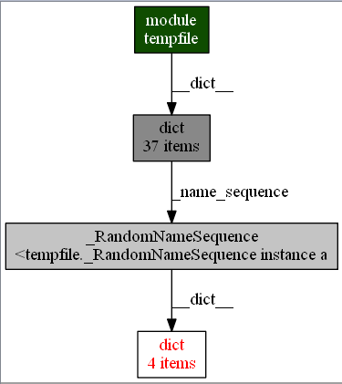

## Python内存泄露查询

```
需求背景
最近项目在压力测试期间，进程在运行中内存持续增加，物理内存很快就被消耗殆尽。为了服务器能持久提供服务，需要对内存进行诊断。
本文讨论Python层内存对象的检查，CPython扩展产生的泄露不在本文讨论范围。
```


Python垃圾回收机制背景：

Python利用引用计数进行垃圾回收，当引用为0时，对象会被虚拟机析构内存会被释放。环引用则需要通过 **标记-清除算法**(`Mark-Sweep`) 来销毁对象。如果对象实现了__del__方法，由于gc无法断定销毁是否会__del__，gc无法处理这类对象。


####需要处理的异常情况包括：
- **垃圾对象**：gc概念上的垃圾对象
- **泄露对象**：对象在逻辑上应该被销毁，但是有外部引用，导致对象没有销毁
- **环引用对象**：环引用对象会增加gc的cpu消耗，会延长对象回收时间


####解决方法
1. 垃圾对象处理：Python类尽量不要实现__del__方法，用其他机制实现就能避免垃圾对象。
2. 泄露对象解决：需要对逻辑层面十分了解，能知道如何判断一个对象是否是为逻辑层面应该销毁的对象。一般而言，对象用一个属性来标识是否已销毁，利用`gc.getobject`遍历对象全集，通过标识进行判断就能找出不正常的对象。利用`objgraph.show_chain(objgraph.find_backref_chain(obj, objgraph.is_proper_module))`生成引用链，解除异常引用解决问题。
3. 环引用对象处理：先`gc.set_debug(gc.DEBUG_SAVEALL)`，然后`gc.collect()`，再通过对`gc.garbage`里的对象利用引用关系进*DFS*遍历，记录所有找到的环。对记录的环引用中的对象，在销毁的时候解除引用即可。


####最后分享Python几个常用的内存调试工具：
- [memory-tools](https://pypi.python.org/pypi/memory-tools/1.0.5)模块，summarize_objects()可以统计内存中各个class实例数量和所占内存量，并排序输出。可以通过查看对象数量和内存量来分析异常情况。
```
Objects count 3,790
Objects size 833,344

      Size Count Type
   476,864   296 <type 'dict'>
    76,320   954 <type 'wrapper_descriptor'>
    64,920   541 <type 'function'>
    ...

Count       Size Type
  954     76,320 <type 'wrapper_descriptor'>
  541     64,920 <type 'function'>
  515     37,080 <type 'builtin_function_or_method'>
  ...
```
- [objgraph](https://pypi.python.org/pypi/objgraph/3.1.2)模块，可以统计类型对应实例数量，统计类型增长情况，获得指定类型所有实例，**获得指定对象的引用链**
- [memory_profiler](https://pypi.python.org/pypi/memory_profiler/0.50.0)可对Python代码逐行显示Mem增量，便于发现内存消耗高的代码块
```
Line #    Mem usage  Increment   Line Contents
==============================================
     3                           @profile
     4      5.97 MB    0.00 MB   def my_func():
     5     13.61 MB    7.64 MB       a = [1] * (10 ** 6)
     6    166.20 MB  152.59 MB       b = [2] * (2 * 10 ** 7)
     7     13.61 MB -152.59 MB       del b
     8     13.61 MB    0.00 MB       return a
```
